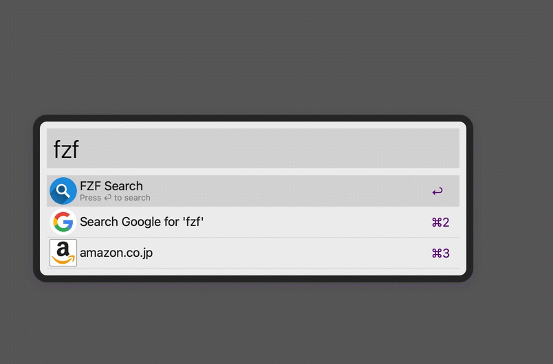
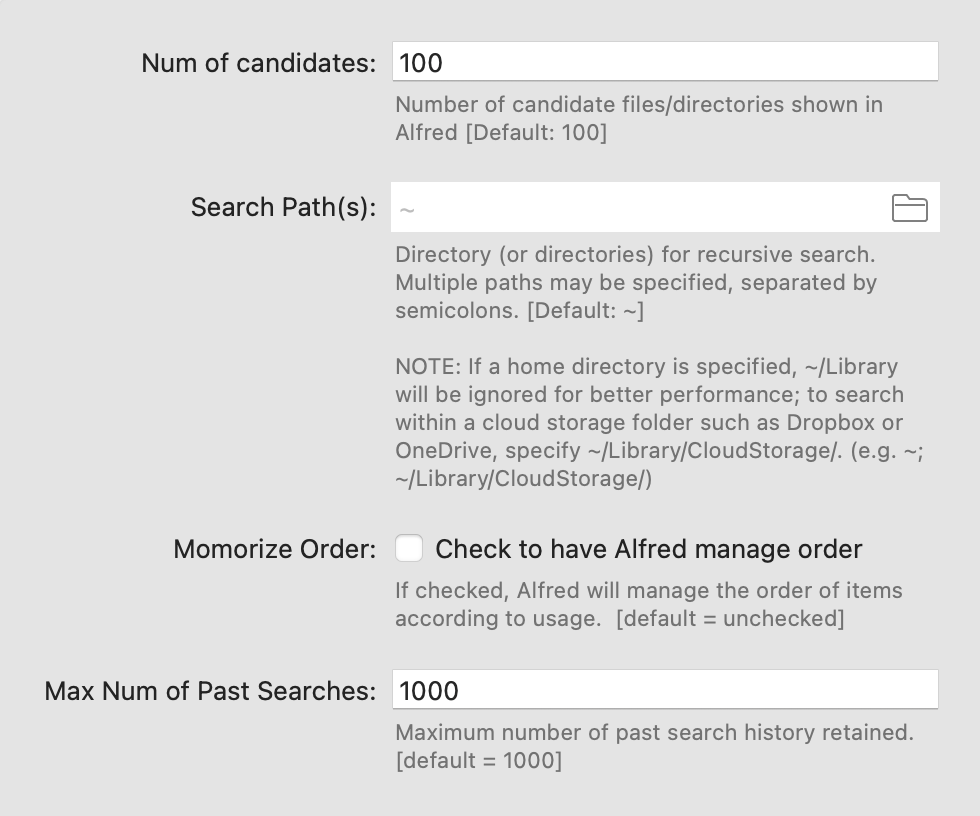
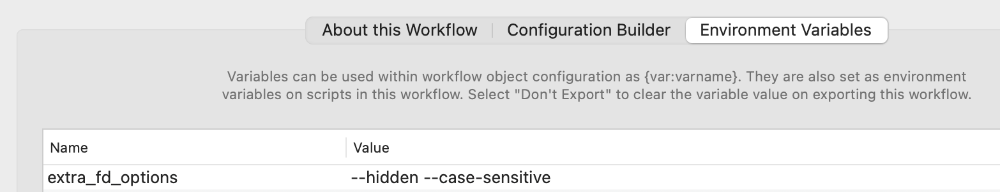

# <span></span> fzf-alfred-workflow

An [Alfred](https://www.alfredapp.com/) workflow fo fuzzy find files/directories using [fzf](https://github.com/junegunn/fzf) and [fd](https://github.com/sharkdp/fd).


## Features

- ⚡️ **Fuzzy Search**: You can enter search keys that partially match file/directory paths *in any order*. 
- 🧠 **Memorization**: Alfred manages the order of items according to *past usage*.
- 🗂 **Folder Action**: Search directory can be set in user preferences or specified dynamically in a *folder action*.
- 📝 **Editable Search History**: *Search history* is automatically recorded and can be edited later.



**Change Log**

- 1.7.0: Environment variable `fd_options` added
- 1.6.2: Notification on first run after macos startup
- 1.5.3: `fzf` and `fd` detection improved
- 1.5.2: `fzf-history` and `fzf-edit-history` commands added
- 1.4.0: Better performance; Alfred Gallery](https://alfred.app/workflows/yohasebe/fzf/) inclusion
- 1.3.2: fzf and fd installation is automatically detected
- 1.3.1: `fzf-cd-module` hotkey feature added (thanks to pSpitzner)
- 1.3.0: check-for-update has been removed (in preparation for application to Alfred Gallery)
- 1.2.2: check-for-update command has been added
- 1.1.1: File and directory searches can be set with `-f` and `-d`, respectively (in addition to `^f` and `^d`).
- 1.1.0: Memorize order option (`memorize`) is added and set default to `true`
- 1.0.2: Search path option (`search_path`) is set default to `~` (home directory)
- 1.0.1: User configuration made available for Alfred 5

## Installation

There are two ways to install this workflow:

1. Automatic Installation via [Alfred Gallery](https://alfred.app/workflows/yohasebe/fzf/)
2. Manual Installation (see below)

## Downloads

Current Version: **1.7.0**

- [⤓ Download Workflow for Alfred 5](https://github.com/yohasebe/fzf-alfred-workflow/raw/main/fzf-alfred-workfow.alfredworkflow)

## Dependencies

Installation of `fzf` and `fd` is only required if the workflow is installed manually. 

- [Alfred Powerpack](https://www.alfredapp.com/powerpack/)
- [fzf](https://github.com/junegunn/fzf): a general-purpose command-line fuzzy finder
- [fd](https://github.com/sharkdp/fd): a simple, fast and user-friendly alternative to *find*

Using [homebrew](https://brew.sh/):

```shell
brew install fzf
brew install fd
```

### Setting Up



Set values to the following options in `User Configuration` (Alfred 5):

| Setting                  | Explanation                                                                        |
| -----------------        | ---------------------------------------------------------------------------------- |
| Num of candidates        | Number of candidate files/directories shown in Alfred (default: 100)               |
| Search path(s)           | Directory from which recursive fzf searches are conducted (default: `~`) __\*__    |
| Memorize order           | If checked or set `true`, Alfred will manage the order of items according to usage |
| Max Num of Past Searches | Maximum number of past search history retained (default: 1000                      |

__\*__ Search directory can be also specified dynamically in a [folder action](https://www.alfredapp.com/universal-actions/).

> **Note 1** <br />
> Multiple paths may be specified in "Search path(s)" separated by semicolons. If a home directory is specified, `~/Library` will be ignored for better performance; to search within a cloud storage folder such as Dropbox or OneDrive, specify `~/Library/CloudStorage/`. (e.g. `~; ~/Library/CloudStorage/`)

> **Note 2** <br />
> If changes to “Search path(s)” do not take effect, restarting your Mac may resolve the issue.

## File/Directory Search

### Fallback search

Setup: Features → Default Results → Setup fallback results → Add Workflow Trigger "FZF Search"

Type in search keys and select "FZF Search"

### Folder action

Setup: Features → Universal Actions → Actions → Check Workflow File Actions

Select a folder in the Finder and launch File Action "FZF Search from Here". The selected folder will be the search path that temporarily overrides the search path specified in the user settings.

### Using keyword

Type in `fzf` and enter search keys

### Using user-specified hotkey

Setup: Features → Workflows → fzf-alfred-workflow → Double click "fzf workflow activation hotkey"

Press the hotkey specified and type enter search keys

## Repeated Directory Change

### `fzf-cd` hotkey

Setup: Features → Workflows → fzf-alfred-workflow → Double click "fzf-cd hotkey"

Select a folder in a Finder window or Alfred folder browser. Then press the hotkey. You can do this repeatedly until you finally reach the target file or directory.

> Thanks to [Paul Spitzner](https://github.com/pSpitzner) for suggesting this.

## List and Edit Search History

The search key is automatically recorded in a file name (`fzf-search-history.txt`) in the workflow data directory (only if more than one search result is found).

### Using keyword

The `fzf-history` command reads this file and allows you to select one of your previous searches and repeat it. 

### Using user-specified hotkey

Setup: Features → Workflows → fzf-alfred-workflow → Double click "fzf history search hotkey".

### Editing Search History

The fzf-edit-history command sends the path to the history file to Alfred, allowing you to edit it in the app of your choice. The history file contains lines of text, each consisting of the date and time of a past search, followed by the search key separated by a single vertical line (|).

Example: `2023-05-13 20:14:51 +0900 | search string`

Hotkey Setup: Features → Workflows → fzf-alfred-workflow → Double click "fzf history edit hotkey".

## Example Usage

Suppose you have an mp3 music folder and Metallica's *Master of Puppets* album in it, just for instance.

### File/Directory Search

`fzf metallica puppets`

The above will fetch you both files and directories. The order of search keys (`metallica` and `puppets`) does not matter.

> /music/**metallica**/master-of-**puppets**/ \
> /music/**metallica**/master-of-**puppets**/01-battery.mp3 \
> /music/**metallica**/master-of-**puppets**/02-master-of-puppets.mp3 \
> /music/**metallica**/master-of-**puppets**/03-the-thing-that-should-not-be.mp3 \
> /music/**metallica**/master-of-**puppets**/04-welcome-home.mp3 \
> /music/**metallica**/master-of-**puppets**/05-disposable-heroes.mp3 \
> /music/**metallica**/master-of-**puppets**/06-leper-messiah.mp3 \
> /music/**metallica**/master-of-**puppets**/07-orion.mp3 \
> /music/**metallica**/master-of-**puppets**/08-damage-inc.mp3

You can narrow them down by adding search keys. Again, the order of search keys does not matter.

`fzf metallica puppets damage`

> /music/**metallica**/master-of-**puppets**/08-**damage**-inc.mp3

### File Only Search

Use `^f` or `-f` directive to search files only.

`fzf metallica puppets ^f`

> /music/**metallica**/master-of-**puppets**/01-battery.mp3 \
> /music/**metallica**/master-of-**puppets**/02-master-of-puppets.mp3 \
> /music/**metallica**/master-of-**puppets**/03-the-thing-that-should-not-be.mp3 \
> /music/**metallica**/master-of-**puppets**/04-welcome-home.mp3 \
> /music/**metallica**/master-of-**puppets**/05-disposable-heroes.mp3 \
> /music/**metallica**/master-of-**puppets**/06-leper-messiah.mp3 \
> /music/**metallica**/master-of-**puppets**/07-orion.mp3 \
> /music/**metallica**/master-of-**puppets**/08-damage-inc.mp3

### Directory Only Search

Use `^d` or `-d` directive to search directories only.

`fzf metallica puppets ^d`

> /music/**metallica**/master-of-**puppets**/

## Advanced Usage

You can set options to the `fd` command that searches for files and folders to be passed to `fzf`. The default option is `--exclude Library` to exclude the `Library` directories in the current search path, which helps speed up the search for users who do not need to search in the `Library` directories.

You can change this option by setting the environment variable `fd_options` in the workflow configuration. For example, if you set the environment variable `fd_options` to `--hidden --case-sensitive`, as shown below, hidden files such as dot files will be included in the search, and the search will be case-sensitive (and `Library` directories will not be excluded anymore).



Note that these options are appended internally with the options automatically specified by this workflow such as `--type f` or `--type d` to search files or directories only.

Please refer to [command-line options](https://github.com/sharkdp/fd?tab=readme-ov-file#command-line-options) for the options available for `fd`.

## Acknowledgments

The icon of this workflow <span></span> is used under [Simplified Pixabay License](https://pixabay.com/ja/service/license/)

## Author

Yoichiro Hasebe (<yohasebe@gmail.com>)

## License

The MIT License

## Disclaimer

The author of this software takes no responsibility for any damage that may result from using it. 

