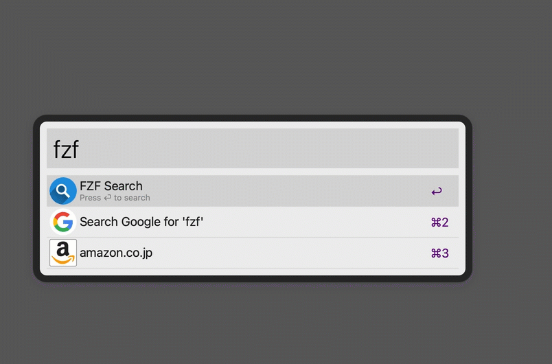
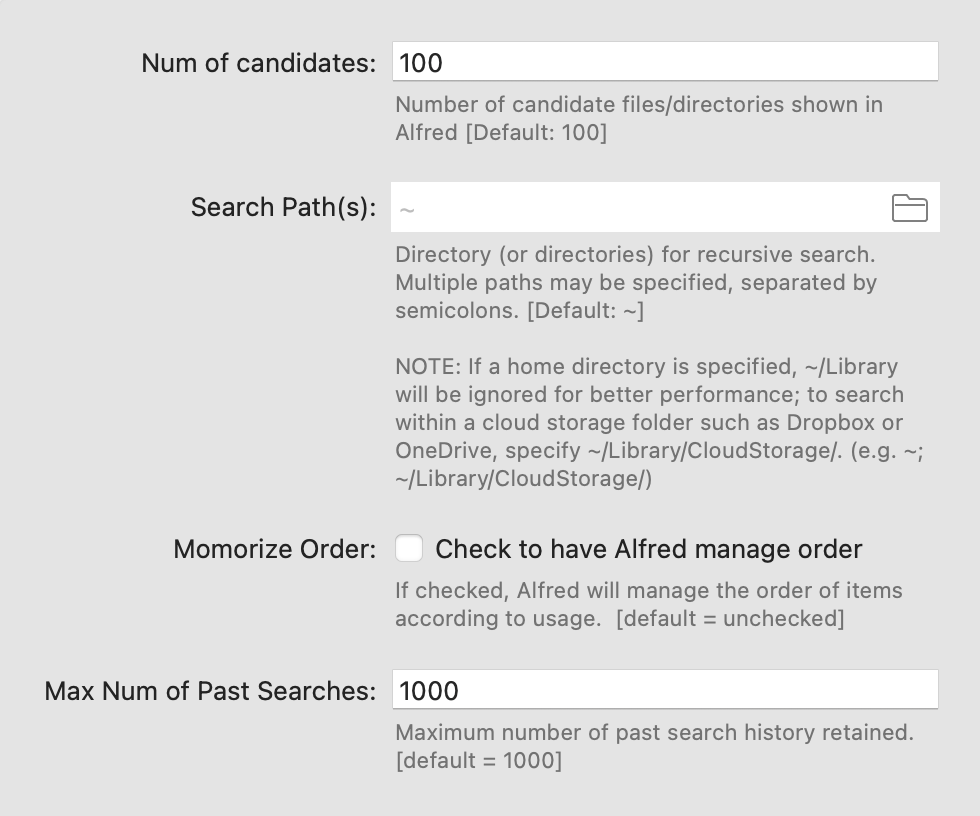
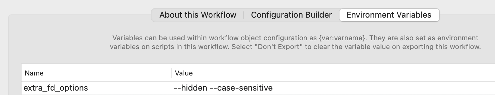

# <span></span> fzf-alfred-workflow

An [Alfred](https://www.alfredapp.com/) workflow to fuzzy find files/directories using [fzf](https://github.com/junegunn/fzf) and [fd](https://github.com/sharkdp/fd).


## Features

- ⚡️ **Fuzzy Search**: You can enter search keys that partially match file/directory paths *in any order*. 
- 🧠 **Memorization**: Alfred manages the order of items according to *past usage*.
- 🗂 **Folder Action**: Search directory can be set in user preferences or specified dynamically in a *folder action*.
- 📝 **Editable Search History**: *Search history* is automatically recorded and can be edited later.
- 🌏 **Unicode-Normalization Aware**: macOS saves filenames in either composed or decomposed form, often side by side in the same folder. Search keys match *both*, so a name typed through a Japanese IME finds files either way.



**Change Log**

- 1.12.0: Modifier keys on a result: ⌘ reveals it in Finder, ⌃ or ⌥ copies its path, ⇧ opens its enclosing folder as before
- 1.11.0: Search history now records a search when one of its results is chosen, instead of recording every keystroke along the way; repeating a search moves it back to the top rather than adding a duplicate; `fzf-history` collapses repeats, so history files written by earlier versions read as a list of searches too
- 1.10.0: Filenames stored in either Unicode normalization form are now matched, so a query typed through a Japanese IME finds names macOS saved in decomposed form; optional candidate cache makes repeat searches on large search paths instant; results can be previewed with Quick Look; packages/bundles are handled correctly (see below); queries are no longer passed through a shell
- 1.9.2: Show a clear error message in Alfred and the debugger when `fd` or `fzf` cannot be located, instead of silently returning no results
- 1.9.1: Auto-detect `fd` and `fzf` in common Homebrew paths as a safety net for unusual setups (issue #10)
- 1.9.0: Exclude Pattern(s) setting added to easily exclude common folders (e.g., `node_modules`, `.git`) from search results
- 1.8.0: Package/bundle handling option added (treat as files by default, optionally as directories); custom package extensions via `package_extensions` environment variable
- 1.7.1: Environment variable `fd_options_conf` added
- 1.6.2: Notification on first run after macos startup
- 1.5.3: `fzf` and `fd` detection improved
- 1.5.2: `fzf-history` and `fzf-edit-history` commands added
- 1.4.0: Better performance; Alfred Gallery](https://alfred.app/workflows/yohasebe/fzf/) inclusion
- 1.3.2: fzf and fd installation is automatically detected
- 1.3.1: `fzf-cd-module` hotkey feature added (thanks to pSpitzner)
- 1.3.0: check-for-update has been removed (in preparation for application to Alfred Gallery)
- 1.2.2: check-for-update command has been added
- 1.1.1: File and directory searches can be set with `-f` and `-d`, respectively (in addition to `^f` and `^d`).
- 1.1.0: Memorize order option (`memorize`) is added and set default to `true`
- 1.0.2: Search path option (`search_path`) is set default to `~` (home directory)
- 1.0.1: User configuration made available for Alfred 5

## Installation

There are two ways to install this workflow:

1. Automatic Installation via [Alfred Gallery](https://alfred.app/workflows/yohasebe/fzf/)
2. Manual Installation (see below)

## Downloads

Current Version: **1.12.0**

- [⤓ Download Workflow for Alfred 5](https://github.com/yohasebe/fzf-alfred-workflow/raw/main/fzf-alfred-workfow.alfredworkflow)

## Dependencies

Installation of `fzf` and `fd` is only required if the workflow is installed manually. 

- [Alfred Powerpack](https://www.alfredapp.com/powerpack/)
- [fzf](https://github.com/junegunn/fzf): a general-purpose command-line fuzzy finder
- [fd](https://github.com/sharkdp/fd): a simple, fast and user-friendly alternative to *find*

Using [homebrew](https://brew.sh/):

```shell
brew install fzf
brew install fd
```

### Setting Up



Set values to the following options in `User Configuration` (Alfred 5):

| Setting                       | Explanation                                                                        |
| ----------------------------  | ---------------------------------------------------------------------------------- |
| Num of candidates             | Number of candidate files/directories shown in Alfred (default: 100)               |
| Search Path(s)                | Directory from which recursive fzf searches are conducted (default: `~`) __\*__    |
| Memorize Order                | If checked or set `true`, Alfred will manage the order of items according to usage |
| Max Num of Past Searches      | Maximum number of past search history retained (default: 1000)                      |
| Exclude Pattern(s)            | Folder/file name patterns to exclude from search, separated by semicolons (default: `node_modules;.git;`) __\*\*\*__ |
| Treat Packages as Directories | If checked, packages/bundles (.app, .key, .pages, etc.) are treated as directories and their contents are searchable (default: unchecked) __\*\*__ |
| Candidate Cache (seconds)     | Reuse the file list found by `fd` for this many seconds instead of walking the search path again on every keystroke (default: `0`, i.e. disabled) __\*\*\*\*__ |

__\*__ Search directory can be also specified dynamically in a [folder action](https://www.alfredapp.com/universal-actions/).

__\*\*\*__ Patterns are matched by name against all files and folders in the search tree, regardless of their location. For example, `node_modules` excludes every `node_modules` folder and its contents. Glob wildcards are supported (e.g., `*.log`, `*cache*`).

__\*\*\*\*__ Walking the search path is the slowest part of a search, and it happens again for every character you type. With a cache of, say, `60`, the walk happens at most once a minute and everything in between is instant. The trade-off is that a file created in the last few seconds may not appear yet. Leave it at `0` if you want every search to see the current state of the disk.

__\*\*__ By default (unchecked), packages/bundles are treated as files and excluded from directory searches using `^d` or `-d`. When searching for files with `^f` or `-f`, packages appear as files but their contents are not searchable. See [Advanced Usage](#advanced-usage) for more details on package handling.

> **Note 1** <br />
> Multiple paths may be specified in "Search path(s)" separated by semicolons. If a home directory is specified, `~/Library` will be ignored for better performance; to search within a cloud storage folder such as Dropbox or OneDrive, specify `~/Library/CloudStorage/`. (e.g. `~; ~/Library/CloudStorage/`)

> **Note 2** <br />
> If changes to "Search path(s)" do not take effect, restarting your Mac may resolve the issue.

## File/Directory Search

### Acting on a result

| Key | Action |
| --- | ------ |
| ⏎ | Open the file or folder |
| ⇧⏎ | Open its enclosing folder |
| ⌘⏎ | Reveal it in Finder |
| ⌃⏎ or ⌥⏎ | Copy its path to the clipboard |

Copying is on two modifiers because Alfred's "Show Actions with Control" setting, if you have it on, opens the action panel before ⌃ reaches the workflow. Whichever of the two you press, you get the path.

Alfred's own preview key also works on a result, so you can look inside a file without opening it.

### Fallback search

Setup: Features → Default Results → Setup fallback results → Add Workflow Trigger "FZF Search"

Type in search keys and select "FZF Search". Holding ⌘ while selecting it searches files only, and holding ⌥ searches directories only.

### Folder action

Setup: Features → Universal Actions → Actions → Check Workflow File Actions

Select a folder in the Finder and launch File Action "FZF Search from Here". The selected folder will be the search path that temporarily overrides the search path specified in the user settings.

### Using keyword

Type in `fzf` and enter search keys

### Using user-specified hotkey

Setup: Features → Workflows → fzf-alfred-workflow → Double click "fzf workflow activation hotkey"

Press the hotkey specified and type enter search keys

## Repeated Directory Change

### `fzf-cd` hotkey

Setup: Features → Workflows → fzf-alfred-workflow → Double click "fzf-cd hotkey"

Select a folder in a Finder window or Alfred folder browser. Then press the hotkey. You can do this repeatedly until you finally reach the target file or directory.

> Thanks to [Paul Spitzner](https://github.com/pSpitzner) for suggesting this.

## List and Edit Search History

The search key is automatically recorded in a file named `fzf-search-history.txt` in the workflow data directory. A search is recorded when you *choose* one of its results, not while you are typing it, so the history holds searches that actually led somewhere rather than every prefix along the way. Repeating a search moves it back to the top of the list instead of adding a second copy.

Past searches are listed by the `fzf-history` command below, which is where all of them live: typing `fzf` offers it alongside `FZF Search`.

### Using keyword

The `fzf-history` command reads this file and allows you to select one of your previous searches and repeat it. Selecting an entry runs that search straight away. Repeated searches are collapsed into a single entry showing when you last made it, so a history file written by an earlier version, which recorded every keystroke, still reads as a list of searches.

### Cleaning up a history file from an earlier version

Versions before 1.11.0 recorded the query on every keystroke, so each search left the fragments typed on the way to it in the file. `fzf-history` hides exact repeats, but the fragments remain. To remove them from the file itself:

```shell
ruby tools/prune-search-history.rb            # show what would be removed
ruby tools/prune-search-history.rb --apply    # rewrite the file
```

A line is treated as a fragment when a search recorded within a minute of it is one of its prefixes, or is a prefix of it. The time limit is what keeps `budget` and `budget 2024` searched hours apart as two searches, while the same pair typed a second apart is one. The original file is copied to `fzf-search-history.txt.bak-<timestamp>` before anything is written.

### Using user-specified hotkey

Setup: Features → Workflows → fzf-alfred-workflow → Double click "fzf history search hotkey".

### Editing Search History

The fzf-edit-history command sends the path to the history file to Alfred, allowing you to edit it in the app of your choice. The history file contains lines of text, each consisting of the date and time of a past search, followed by the search key separated by a single vertical line (|).

Example: `2023-05-13 20:14:51 +0900 | search string`

Hotkey Setup: Features → Workflows → fzf-alfred-workflow → Double click "fzf history edit hotkey".

## Example Usage

Suppose you have an mp3 music folder and Metallica's *Master of Puppets* album in it, just for instance.

### File/Directory Search

`fzf metallica puppets`

The above will fetch you both files and directories. The order of search keys (`metallica` and `puppets`) does not matter.

> /music/**metallica**/master-of-**puppets**/ \
> /music/**metallica**/master-of-**puppets**/01-battery.mp3 \
> /music/**metallica**/master-of-**puppets**/02-master-of-puppets.mp3 \
> /music/**metallica**/master-of-**puppets**/03-the-thing-that-should-not-be.mp3 \
> /music/**metallica**/master-of-**puppets**/04-welcome-home.mp3 \
> /music/**metallica**/master-of-**puppets**/05-disposable-heroes.mp3 \
> /music/**metallica**/master-of-**puppets**/06-leper-messiah.mp3 \
> /music/**metallica**/master-of-**puppets**/07-orion.mp3 \
> /music/**metallica**/master-of-**puppets**/08-damage-inc.mp3

You can narrow them down by adding search keys. Again, the order of search keys does not matter.

`fzf metallica puppets damage`

> /music/**metallica**/master-of-**puppets**/08-**damage**-inc.mp3

### File Only Search

Use `^f` or `-f` directive to search files only.

`fzf metallica puppets ^f`

> /music/**metallica**/master-of-**puppets**/01-battery.mp3 \
> /music/**metallica**/master-of-**puppets**/02-master-of-puppets.mp3 \
> /music/**metallica**/master-of-**puppets**/03-the-thing-that-should-not-be.mp3 \
> /music/**metallica**/master-of-**puppets**/04-welcome-home.mp3 \
> /music/**metallica**/master-of-**puppets**/05-disposable-heroes.mp3 \
> /music/**metallica**/master-of-**puppets**/06-leper-messiah.mp3 \
> /music/**metallica**/master-of-**puppets**/07-orion.mp3 \
> /music/**metallica**/master-of-**puppets**/08-damage-inc.mp3

### Directory Only Search

Use `^d` or `-d` directive to search directories only.

`fzf metallica puppets ^d`

> /music/**metallica**/master-of-**puppets**/

## Advanced Usage

### Customizing fd Options

You can set options to the `fd` command that searches for files and folders to be passed to `fzf`. The default option is `--exclude Library` to exclude the `Library` directories in the current search path, which helps speed up the search for users who do not need to search in the `Library` directories.

You can change this option by setting the environment variable `fd_options_conf` in the workflow configuration. For example, if you set the environment variable `fd_options_conf` to `--hidden --case-sensitive`, as shown below, hidden files such as dot files will be included in the search, and the search will be case-sensitive (and `Library` directories will not be excluded anymore).



Note that these options are appended internally with the options automatically specified by this workflow such as `--type f` or `--type d` to search files or directories only.

`fd` is run directly rather than through a shell, so this setting is split into arguments the way a shell would split it, but no shell expansion happens afterwards: a leading `~` is expanded for you, while glob characters are passed to `fd` as they are written rather than being expanded against your files first. This is usually what you want for `--exclude` patterns.

> **Tip:** If you only need to exclude specific folder names (e.g., `node_modules`, `.git`), use the `Exclude Pattern(s)` setting in the Configuration Builder instead. `fd_options_conf` is best suited for non-exclude options such as `--hidden` or `--case-sensitive`.

Please refer to [command-line options](https://github.com/sharkdp/fd?tab=readme-ov-file#command-line-options) for the options available for `fd`.

### Package/Bundle Handling

macOS applications and some file formats are actually directories (packages/bundles) that appear as single files in Finder. By default, the workflow treats them as files to avoid cluttering search results with package contents.

**Default Package/Bundle Extensions:**

`.app`, `.bundle`, `.framework`, `.plugin`, `.kext`, `.key`, `.pages`, `.numbers`, `.sketch`, `.xcodeproj`, `.playground`, `.photoslibrary`, `.xcassets`

**Adding Custom Package Extensions:**

You can add additional package extensions by setting the environment variable `package_extensions` in the workflow configuration. Specify extensions as a **comma-separated list** (with or without leading dots):

```
graffle, rtfd, band
```

or

```
.graffle, .rtfd, .band
```

**Note:** Extensions must be separated by commas. Leading dots are optional and will be added automatically if omitted. Spaces around commas are automatically trimmed.

These custom extensions will be combined with the default list.

**Behavior with "Treat Packages as Directories" Option:**

When the option is **unchecked** (default):
- `^d` or `-d`: Search only regular directories (packages/bundles excluded)
- `^f` or `-f`: Search files and packages/bundles as files (package contents excluded)
- Default search: Both files and directories, plus packages as files (package contents excluded)

When the option is **checked**:
- `^d` or `-d`: Search all directories including packages/bundles
- `^f` or `-f`: Search all files including those inside packages/bundles
- Default search: Everything including package contents

## Acknowledgments

The icon of this workflow <span></span> is used under [Simplified Pixabay License](https://pixabay.com/ja/service/license/)

## Author

Yoichiro Hasebe (<yohasebe@gmail.com>)

## License

The MIT License

## Disclaimer

The author of this software takes no responsibility for any damage that may result from using it. 

